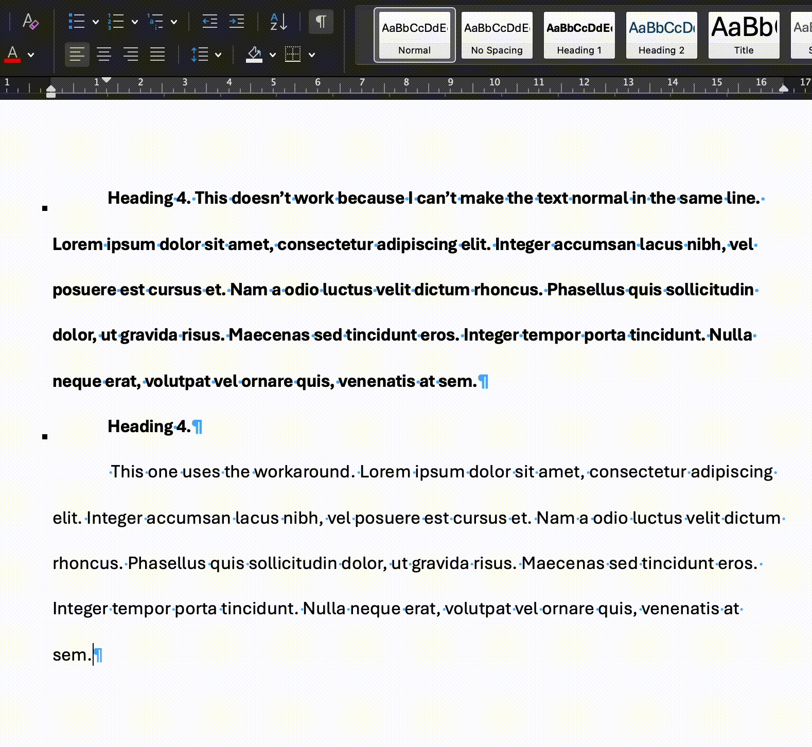

+++
title = 'Microsoft Word is unable to style a document properly'
date = 2025-08-25T09:00:00-03:00
tags = ['Microsoft Office', 'Word', 'Rant']
+++

It's no secret that Microsoft Office is the *de facto* standard for office
programs. It's been like this for as long as I can remember. And because of
this, it is the preferred solution for companies and educational
organizations. I recently started to study Software Engeneering[^1], and both
the organization and the teachers uses Microsoft Word for assignments and
whatsoever.

[^1]: I have no formal studies in the STEM field, although I've been a tech
enthusiast since I was three and programming since I was 9, so I am basically
smurfing in the technical subjects, although I am learning a lot in maths and
the engeneering ones.

Personally, I hadn't used Word for more than a decade now. I've been basically
using (1) org-mode if I have to take notes of something, (2) LaTeX if I have to
write a proper paper and (3) Libre Office[^2] or Google Docs for some other
basic cases. However, as my university colleagues and friends, even being in the
Software Engineering course, have not a strong technical background, I felt
compelled to download Microsoft Office for the sake of my studies.

[^2]: I find Libre Office much more intuitive than Microsoft Office, although I
reckon it has many limitations. I simply can't get my head around Ribbon, and
Libre Office has worked for me well as an alternative to Microsoft Office.

It didn't take long for me to be disappointed. In one of our courses, the
professor asked us to make an investigation report using the APA style. As the
other components of my group are not well versed in academics and I took for
myself the task of formatting the document. Now comes the issue: [APA headings].

[APA headings]:
https://apastyle.apa.org/style-grammar-guidelines/paper-format/headings

There's not much trouble implementing them in Word styles regarding font family,
font size, font style, paragraph spacing and first line indentation. However,
the fourth and fifth headings are straight impossible to implement in Microsoft
Word for a single detail: the "text begins on the same line and continues as a
regular paragraph".

How one implements this kind of heading in Word? First of all, we should notice
that, from a style[^3] perspective, it's simply not possible. There's nothing
in the style configuration that allows it to be "inline". Styles usually are
separated by a paragraph marker, which means, that, by definition, different
styles appear in different paragraphs. The solution that Word has for this case
is called "style separator". Basically, it is a semantic marker, similar to a
page break (in oposition to those who simply break the line until the content is
moved to the next page), section break, or paragraph marker (which is used by
default in Word in place of a new line character). Whenever you use this style
separator, it semantically indicates that the previous style ends here and a
different style can be used in the text that follows. In theory, I could apply
the "Heading 4" or "Heading 5" style to a portion of my text, use this style
separator and keep writing in the same paragraph.[^4] Except that it doesn't
exist in my version of Microsoft Word.

[^3]: Style, here, refers to the Microsoft Word concept of style, sets of
formatting instructions that can be applied to text, lists, and tables to ensure
consistent appearance and allow for quick document-wide updates. They are
important when dealing with academic paper styling to ensure that the document
remains consistent, but also for semantics. For instance, heading styles have
the correct semantics to structure the document and sections and subsections,
which can later be used to generate automatically a table of contents, is used
in the exported PDF table of contents, among other important things.

[^4]: This, by itself, in my opinion, is already a subpar experience, as I'm
decoupling something that should be coupled with the style. For instance, if I
decided to change a heading from level 3 to 4, it should automatically force the
following content to the same line. It is even worse in the reverse case, as I
may convert a level 4 heading to a lower level and not notice that there's a
style separator.

It seems that this feature simply was never implemented for the macOS version of
Microsoft Word. At least I couldn't find it anywhere, there's no documentation
about it, and [this question] on Microsoft Learn has an answer from a Microsoft
MVP that confirms it.

[this question]:
https://learn.microsoft.com/en-us/answers/questions/4869157/style-separator-in-word-2016-for-mac

There is, though, a workaround. The same answer says that, in macOS, you can
select a paragraph (remember, those are the default markers for changing
styles), open its formatting settings, and under **Format > Font** there's a
option to hide it. Alright, let's do it, then. I've come a long way already, and
it is still quicker than teaching (and convincing) my colleagues to use
LaTeX. Right?

What a world we live in.
