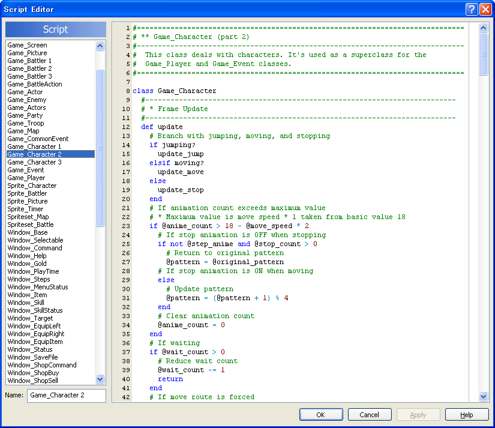

+++
title = 'About me'
date = 2024-06-17
showAuthor = false
showBreadcrumbs = false
showComments = false
showDate = false
showReadingTime = false
showPagination = false
showWordCount = false
+++

My journey as a programmer began back in 2006 when I was 9 years old. At that time, I was particulary interested in creating computer games, a passion that continues to this day. My first experience with game development was through [RPG Maker XP](https://www.rpgmakerweb.com/products/rpg-maker-xp). As soon as I reached the limits of the default engine, I started exploring ways to expand its capabilities, and thus began learning [RGSS (Ruby Game Scripting System)](https://ja.wikipedia.org/wiki/RGSS).

In the same year, I delved deeper into programming in general. I began learning [C](https://en.wikipedia.org/wiki/C_(programming_language)) with [OpenGL](https://en.wikipedia.org/wiki/OpenGL), as that time my focus was on game development). Some time later, I added [HTML](https://en.wikipedia.org/wiki/HTML), [CSS](https://en.wikipedia.org/wiki/CSS), and [JavaScript](https://en.wikipedia.org/wiki/JavaScript) to my skill set. Since then, programming became a hobby, and explored a wide range of technologies, including [TypeScript](https://en.wikipedia.org/wiki/TypeScript), [PHP](https://en.wikipedia.org/wiki/PHP), [Elm](https://en.wikipedia.org/wiki/Elm_(programming_language)), [ReasonML](https://en.wikipedia.org/wiki/Reason_(programming_language)), [C#](https://en.wikipedia.org/wiki/C_Sharp_(programming_language)), [SQL](https://en.wikipedia.org/wiki/SQL), [Python](https://en.wikipedia.org/wiki/Python_(programming_language)), [Dart](https://en.wikipedia.org/wiki/Dart_(programming_language)), [Common Lisp](https://en.wikipedia.org/wiki/Common_Lisp), [Elixir](https://en.wikipedia.org/wiki/Elixir_(programming_language)), [Haskell](https://en.wikipedia.org/wiki/Haskell), [Lua](https://en.wikipedia.org/wiki/Lua_(programming_language)), [CoffeeScript](https://en.wikipedia.org/wiki/CoffeeScript), [Rust](https://en.wikipedia.org/wiki/Rust_(programming_language)), and more.

In 2017, I began my professional programming career. My first job was as a web developer at the college I was studying, and I was responsible for developing and maintaining the new website of the institution, made with [WordPress](https://en.wikipedia.org/wiki/WordPress), and other systems with [Laravel](https://en.wikipedia.org/wiki/Laravel) and Python.

 the website I developed back then.")

Since 2019, I have specialized in mobile development with [Flutter](https://en.wikipedia.org/wiki/Flutter_(software)). From 2021 to 2024, I worked at [BTG Pactual](https://en.wikipedia.org/wiki/BTG_Pactual), the largest investment bank in Latin America. There, I faced my greatest technical challenges. I was responsible for developing and maintaining our in-house chart engine, which allowed users to operate stock investments directly in the chart.

This engine processes large amounts of data and displays multiple overlapping charts with real-time performance. It supports features such as scrolling, zooming, panning, movable drawings, windowed layouts, chart cursors, generic chart overlays, and more.

<figure style="text-align: center">
<iframe width="300" height="650" src="https://www.youtube.com/embed/rtExnXFbse4?playlist=rtExnXFbse4&disablekb=1&controls=0&autoplay=1&mute=1&color=black&fs=0&loop=1" title="YouTube video player" frameborder="0" allow="accelerometer; autoplay; clipboard-write; encrypted-media; gyroscope; picture-in-picture; web-share" referrerpolicy="strict-origin-when-cross-origin" style="margin: auto"></iframe>
<figcaption>A short demonstration of the chart engine I developed for the <a href="https://play.google.com/store/apps/details?id=com.btg.pactual.homebroker.mobile&hl=en">BTG Trader app</a>.</figcaption>
</figure>

I was recently made redundant from BTG Pactual, but I continue to study and improve my skills. In addition to Flutter development, I have been exploring [compilers](https://en.wikipedia.org/wiki/Compiler) and [programming language theory](https://en.wikipedia.org/wiki/Programming_language_theory), two areas of technology that interest me but that I previously had little time to study.

